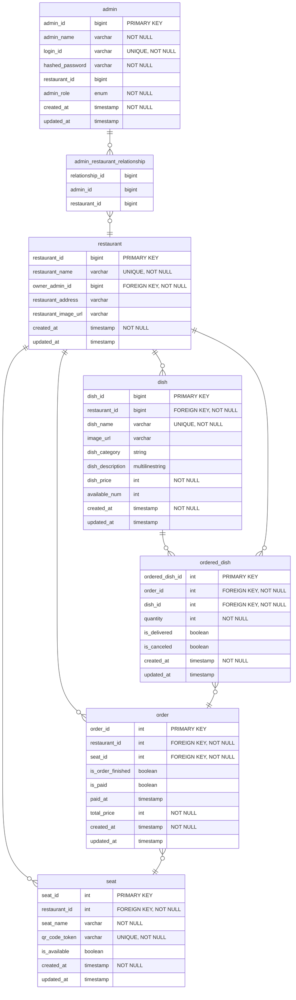

# Database design -  ER diagram

```mermaid
erDiagram
		%% オーナー(owners)から管理者(admins)に変更した %%
		%% is_owner(bool型)からadmin_role(enum型)に変更した %%
		%% admin_roleには、('system', 'owner', 'counter', 'kitchen')が含まれる %%
		admin {  
				admin_id bigint "PRIMARY KEY"
				admin_name varchar "NOT NULL"
				login_id varchar "UNIQUE, NOT NULL"
				hashed_password varchar "NOT NULL"
				restaurant_id bigint 
				admin_role enum "NOT NULL"
				created_at timestamp "NOT NULL"
				updated_at timestamp 
		}

		admin_restaurant_relationship {
				relationship_id bigint
				admin_id bigint
				restaurant_id bigint
		}
		
		restaurant {
        restaurant_id bigint "PRIMARY KEY"
        restaurant_name varchar "UNIQUE, NOT NULL"
        owner_admin_id bigint "FOREIGN KEY, NOT NULL"
				restaurant_address varchar 
				restaurant_image_url varchar
        created_at timestamp "NOT NULL"
				updated_at timestamp 
    }

		%% dish_categoryはオーナーより追加、編集可能 %%
    dish {
        dish_id bigint "PRIMARY KEY"
        restaurant_id bigint "FOREIGN KEY, NOT NULL"
        dish_name varchar "UNIQUE, NOT NULL"
        image_url varchar
				dish_category string 
				dish_description multilinestring
        dish_price int "NOT NULL"
        available_num int 
				created_at timestamp "NOT NULL"
				updated_at timestamp
    }

		%% is_availableのデフォルト値: true %%
    seat {
        seat_id int "PRIMARY KEY"
        restaurant_id int "FOREIGN KEY, NOT NULL"
        seat_name varchar "NOT NULL"
        qr_code_token varchar "UNIQUE, NOT NULL"
        is_available boolean
				created_at timestamp "NOT NULL"
				updated_at timestamp 
    }

		%% is_.*のデフォルト値: false %%
    %% updated_atを追加した %%
    order {
        order_id int "PRIMARY KEY"
        restaurant_id int "FOREIGN KEY, NOT NULL"
        seat_id int "FOREIGN KEY, NOT NULL"
				is_order_finished boolean 
        is_paid boolean 
        paid_at timestamp
				total_price int "NOT NULL"
        created_at timestamp "NOT NULL"
				updated_at timestamp 
    }

		%% is_deliveredのデフォルト値: false %%
		%% quantity, updated_atを追加した %%
    ordered_dish {
        ordered_dish_id int "PRIMARY KEY"
        order_id int "FOREIGN KEY, NOT NULL"

        dish_id int "FOREIGN KEY, NOT NULL"
				quantity int "NOT NULL"
        is_delivered boolean 
				is_canceled boolean
				created_at timestamp "NOT NULL"
				updated_at timestamp 
    }

		admin ||--o{ admin_restaurant_relationship:""
		admin_restaurant_relationship }o--|| restaurant:""
    restaurant ||--o{ dish:""
    restaurant ||--o{ order:""
    restaurant ||--o{ seat:""
    order }o--|| seat:""
    ordered_dish }o--|| order:""
		ordered_dish }o--|| restaurant:""
		dish ||--o{ ordered_dish:""
```